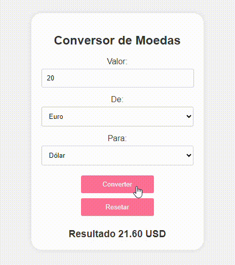

# ``Conversor de Moedas SIMPLES``

## ÍNDICE
* [DESCRIÇÃO](#descrição)
* [FUNCIONALIDADES](#funcionalidades)
* [TECNOLOGIAS UTILIZADAS](#tecnologias-utilizadas)
* [DESIGN](#layout-e-design)
* [RESULTADO](#resultado)
* [AUTORES](#autores)
 
## ``Descrição``
 
Este é um projeto de uma aplicação web simples para conversão de moedas, desenvolvido com HTML5, CSS3 e JavaScript puro. O usuário pode inserir um valor em uma moeda específica e obter o valor convertido em outra moeda com base em taxas de câmbio predefinidas no código.
 
## ``Funcionalidades``
 
- **Entrada de Valor**: Permite ao usuário inserir o valor a ser convertido.
- **Seleção de Moedas**: O usuário pode selecionar a moeda de origem e a moeda de destino a partir de uma lista de opções (Dólar, Euro, Real).
- **Conversão**: Realiza a conversão utilizando taxas de câmbio fixas definidas no código.
- **Reset**: O usuário pode redefinir o valor e as seleções de moedas para realizar uma nova conversão.
- **Interface Responsiva**: A aplicação se ajusta a diferentes tamanhos de tela, funcionando bem em dispositivos móveis e desktops.
 
## ``Tecnologias Utilizadas``
 
- **HTML5**: Estrutura a página com elementos semânticos apropriados.
- **CSS3**: Estilização da interface, garantindo um design atraente e responsivo.
- **JavaScript Puro**: Implementação da lógica de conversão de moedas, manipulação do DOM e atualização em tempo real.
 
## ``Layout e Design``
 
O layout da aplicação é minimalista e é dividido em três partes:
1. **Entrada do Valor e Seleção de Moeda de Origem**
2. **Seleção da Moeda de Destino**
3. **Exibição do Resultado**
 
O design utiliza cores contrastantes para diferenciar os elementos da interface e garantir uma boa usabilidade.
 
## ``Resultado``

## ``Autores``
[Leonardo Rocha](https://github.com/LeonardoRochaMarista/LeonardoRochaMarista)

[Maria Fontinele](https://github.com/dudafontinele)
